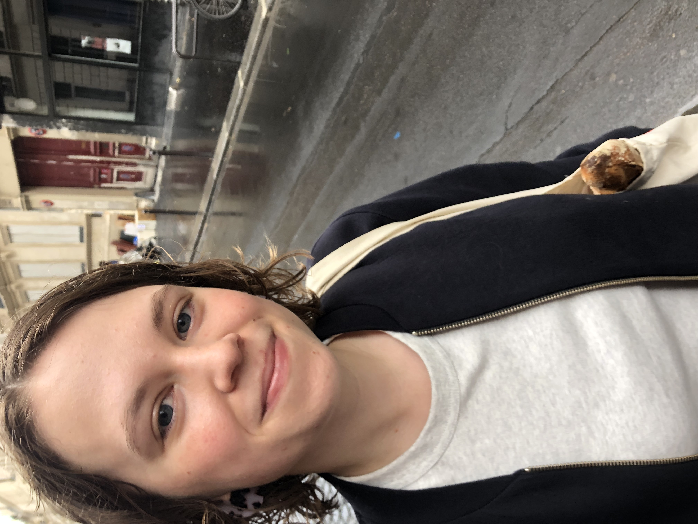

I am a PhD candidate in Chemistry in the lab of [Professor David M. Chenoweth](http://chenowethgroup.chem.upenn.edu/index.html){:target="\_blank"} at the University of Pennsylvania. My research focuses on the synthesis and optimization of small molecule probes and fluorescent dyes for studying biological systems with spatiotemporal control. My work with organic dyes has led me to an interest in the intersection of chemistry and art conservation, resulting in a collaboration with the scientific research department at the Philadelphia Museum of Art.

Before coming to Penn, I earned my undergraduate degree from Yale University, where I worked in the lab of [Professor Scott J. Miller](https://millerlab.yale.edu/){:target="\_blank"} on the synthesis of phosphothreonine-based peptide catalysts. Outside of the lab, I was a writer and editor for *The Yale Record.* My writing has been featured by [*TIME*](https://time.com/4547742/yale-record-hillary-clinton-endorsement/){:target="\_blank"}, [*Quartz*](https://qz.com/818133/election-2016-what-should-i-do-about-my-racist-facebook-friends/){:target="\_blank"}, and [*McSweeney's*](https://www.mcsweeneys.net/articles/im-not-like-other-girls-because-im-trapped-at-the-bottom-of-a-well){:target="\_blank"}.

You can find me at the microscope or contact me at **rlackner@sas.upenn.edu.**

