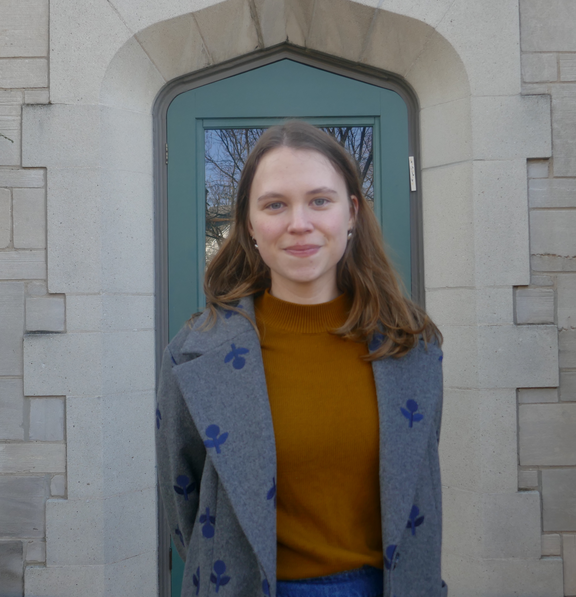

I am a PhD candidate in Chemistry in the lab of [Professor David M. Chenoweth](http://chenowethgroup.chem.upenn.edu/index.html){:target="\_blank"} at the [University of Pennsylvania](https://www.upenn.edu/){:target="\_blank"}. My research focuses on the synthesis of organic dyes and probes that allow us to study biological systems with high levels of spatiotemporal control. My work with organic dyes has led me to an interest in research at the interface of chemistry and art conservation, resulting in a collaboration with the Scientific Research Department at the [Philadelphia Museum of Art](https://philamuseum.org/){:target="\_blank"} to enable the identification and analysis of organic dyes and pigments in the PMA's collection. I am interested in a creative, interdisciplinary approach to the identification and analysis of organic colorants in works of art.

Before coming to Penn, I earned my undergraduate degree in Chemistry from [Yale University](https://www.yale.edu/){:target="\_blank"}, where I worked in the lab of [Professor Scott J. Miller](https://millerlab.yale.edu/){:target="\_blank"} on the synthesis of phosphothreonine-based peptide catalysts. Outside of the lab, I was a writer and Editor-in-Chief at *The Yale Record.* My writing has been featured by [*TIME*](https://time.com/4547742/yale-record-hillary-clinton-endorsement/){:target="\_blank"}, [*Quartz*](https://qz.com/818133/election-2016-what-should-i-do-about-my-racist-facebook-friends/){:target="\_blank"}, and [*McSweeney's*](https://www.mcsweeneys.net/articles/im-not-like-other-girls-because-im-trapped-at-the-bottom-of-a-well){:target="\_blank"}.

You can find me at the microscope or contact me at **rachel.lackner@gmail.com.**

